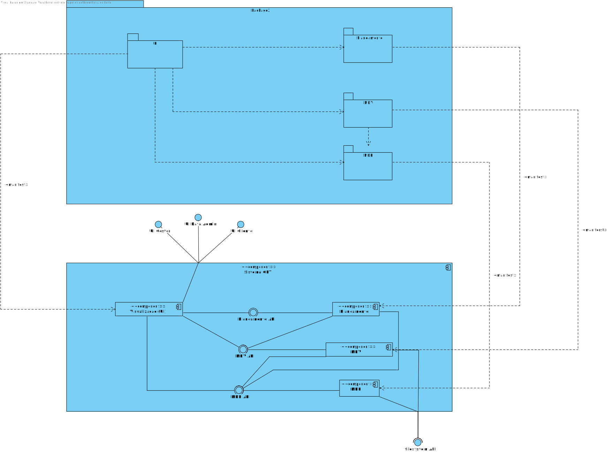
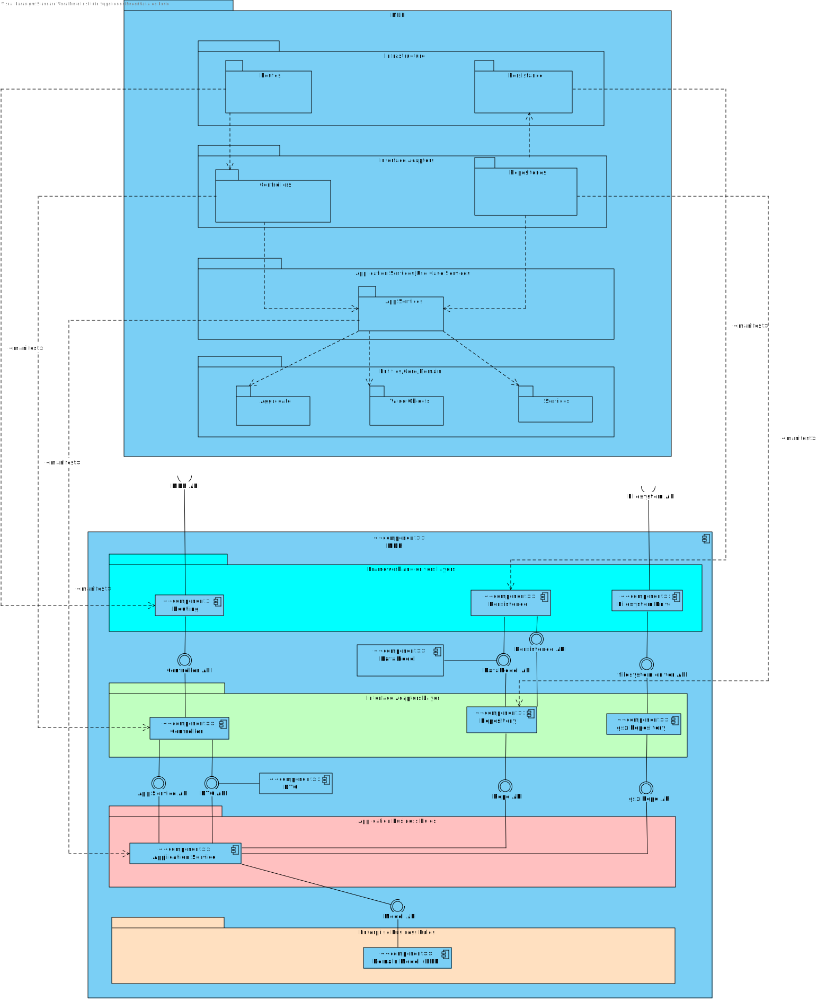

- [Mapping between Views](#mapping-between-views)
	- [Nível 1](#nível-1)
		- [Vista Lógica - Vista de Implementação](#vista-lógica---vista-de-implementação)
		- [Vista de Implementação - Vista Física](#vista-de-implementação---vista-física)
	- [Nível 2](#nível-2)
		- [Vista Lógica - Vista de Implementação](#vista-lógica---vista-de-implementação-1)
	- [Nível 3 (MDR)](#nível-3-mdr)
		- [Vista Lógica - Vista de Implementação](#vista-lógica---vista-de-implementação-2)
		- [Vista de Implementação - Vista Física](#vista-de-implementação---vista-física-2)
	- [Nível 3 (MDV)](#nível-3-mdv)
		- [Vista Lógica - Vista de Implementação](#vista-lógica---vista-de-implementação-3)
		- [Vista de Implementação - Vista Física](#vista-de-implementação---vista-física-3)

# Mapping between Views

## Nível 1
### Vista Lógica - Vista de Implementação

n/a

### Vista de Implementação - Vista Física

n/a

## Nível 2
### Vista Lógica - Vista de Implementação

## Nível 3 (MDR)
### Vista Lógica - Vista de Implementação

### Vista de Implementação - Vista Física
TBD

## Nível 3 (MDV)
### Vista Lógica - Vista de Implementação

### Vista de Implementação - Vista Física
TBD
